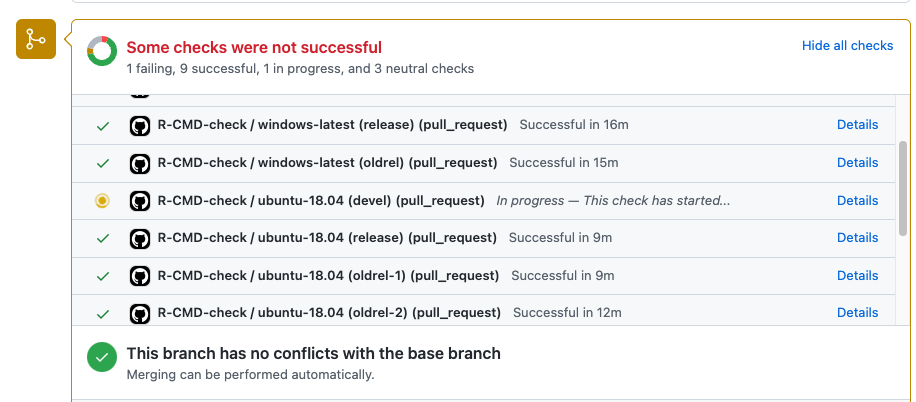

```{r setup, include=FALSE}
# options(htmltools.dir.version = FALSE, width = 120)
# NOTE TO SELF: The CSS styles were created in `create-njt-theme.R`
knitr::opts_chunk$set(
  fig.path = "figures/",
  cache.path = "cache/",
  fig.align = "center",
  fig.width = 13,
  fig.height = 6,
  fig.retina = 3,
  fig.show = "hold",
  external = TRUE,
  # dev = "svglite",
  # dev.args = list(bg = "transparent"),
  message = FALSE,
  warning = FALSE,
  cache = FALSE,
  echo = FALSE,
  autodep = TRUE
)
```

```{r library, include = FALSE}
library(brolgar)
library(tidyverse)
library(visdat)
library(naniar)
library(gganimate)
library(knitr)
library(ggrepel)
library(memer)
library(palmerpenguins)
library(glue)
library(cli)
library(magick)
```

```{r helpers, include=FALSE}
mp4_vid <- function(src){
  HTML(
    paste0(
      '<video autoplay>
        <source src="', src, '" type="video/mp4">
      </video>'
    )
  )
}

fig.fullsize <- c(fig.height = 3.5, fig.width = 8, out.width = "150%"
)

as_table <- function(...) knitr::kable(..., format='html', digits = 3)

theme_set(
  theme_grey(base_size = 16) +
  theme(
    legend.position = "bottom",
    plot.background = element_rect(fill = "transparent"),
    legend.background = element_rect(fill = "transparent")
  )
)

# **ni**ck's **pa**lette
nipa <- list(red = "#c03018",
             orange = "#f0a800",
             green = "#609048",
             purple = "#484878",
             light_purple = "#A3A3BB",
             light_green = "#AFC7A3",
             light_orange = "#F7D37F",
             light_red = "#DF978B",
             pale_purple = "#ECECF1",
             pale_green = "#D7E3D1",
             pale_orange = "#FBE9BF",
             pale_red = "#EFCBC4")

```

# Reflections one year into working as a research software engineer

<br>

### Nicholas Tierney
### Telethon Kids Institute, Perth, Australia
### UseR! 23rd June 2022

`r icons::icon_style(icons::fontawesome(name = 'link', 'solid'), fill = nipa$purple)` **njt-user-2022.netlify.app** 

`r icons::icon_style(icons::fontawesome$brands$twitter, fill = nipa$purple)` **nj_tierney**

---

layout: true
<div class="my-footer"><span>njt-user-2022.netlify.app • @nj_tierney</span></div> 


---
# How/where do I work?

- I am a Research Software Engineer (RSE)
- Working at [Telethon Kids Institute](https://www.telethonkids.org.au/)
- With the [Malaria Atlas Project](https://malariaatlas.org/)
- Primarily with [Nick Golding](https://www.telethonkids.org.au/contact-us/our-people/g/nick-golding/)
- Maintaining [`greta`](https://greta-stats.org/) software
- Embedded within a team
- Not consulted out to teams (usually)
- Develop software to help teams + for specific research problems
- Mixture of remote and at workplace


---

# What sorts of things does an RSE do?

.large[
- Create software to **solve research problems**
- Develop tools that **abstract the right components** to facilitate research
- Help researchers to **find and learn** good tools
- Support researchers with (computational) reproducibility
]

(adapted from Heidi Seibold's [UseR2021 Keynote talk](https://docs.google.com/presentation/d/1XQc2U2X8hiK43UzUi9IwvsvULxhVy0WzWSa_Kt4ZJv4/view#slide=id.gdbfb32d486_0_448))


---

# The past year

.large[
1. Understanding, improving, maintaining `greta`
2. Develop new interfaces for statistical methods
3. COVID modelling for Australian Government
]


---
background-image: url("imgs/greta-logo-background.png")
background-size: contain
class: center, bottom

.pull-left[
Professor Nick Golding
]

.pull-right[
[greta-stats.org](https://www.greta-stats.org)
]


---

# why 'greta' ?

.pull-left[

Grete Hermann (1901 - 1984)

wrote the first algorithms for computer algebra

... without a computer

(To avoid people saying 'greet', the package is spelled _greta_ instead)
]

.pull-right[
```{r show-grete, out.width = "60%"}
include_graphics("imgs/grete-hermann.jpeg")
```

]

---

# What greta looks like

.left-code[


$$
\alpha \sim Normal(0, 5)
$$

$$
\beta \sim Normal(0, 3)
$$

$$
\sigma \sim logNormal(0, 5)
$$
$$
\mu = \alpha + \beta X
$$


$$
Y \sim Normal(\mu, \sigma)
$$


]

.right-plot[

```{r greta-show, eval = FALSE, echo = TRUE}
x <- penguins$bill_length_mm
y <- penguins$flipper_length_mm
alpha <- normal(0,5)
beta <- normal(0,3)
sd <- lognormal(0,3)
mu <- alpha + coef * x
distribution(y) <- normal(mu, sd)
m <- model(mu, beta, sd)
draws <- mcmc(m)
```

]

---
class: inverse, center, middle

# .large[**Designing** new interfaces]

---

# Malaria modelling

[`yahtsee` (Yet Another Hierarchical Time Series Extension + Expansion)](https://github.com/njtierney/yahtsee)

```{r show-code, echo = TRUE, eval = FALSE}
cleaned_data <- data %>%
    as_tibble() %>%
    group_by(who_region) %>% #<<
    transmute(.who_region_id = cur_group_id()) %>% #<<
    ungroup(who_region) %>% #<<
    select(-who_region) %>% #<<
    group_by(country) %>%
    transmute(.country_id = cur_group_id()) %>%
    ungroup(country) %>%
    select(-country) 
```

---

# Malaria modelling

```{r malaria-eg, eval = FALSE, echo = TRUE}
model <- inlabru::bru(
formula = pr ~ avg_lower_age + Intercept + 
  who_region(month_num, #<<
             model = "ar1", 
             group = .who_region_id, #<<
             constr = FALSE) + 
  country(month_num, #<<
          model = "ar1", 
          group = .country_id, #<<
          constr = FALSE),
    family = "gaussian",
    data = malaria_africa_ts,
    options = list(control.compute = list(config = TRUE),
                   control.predictor = list(compute = TRUE, link = 1))
    )
```

---

# Malaria modelling

[`yahtsee` (Yet Another Hierarchical Time Series Extension + Expansion)](https://github.com/njtierney/yahtsee)

```{r eval = FALSE, echo = TRUE}
m <- fit_hts(
  formula = pr ~ avg_lower_age + 
  hts(who_region, #<<
      country), #<<
  .data = malaria_africa_ts,
  family = "gaussian"
)
```

---
class: inverse
.vhuge.center.middle[
**Reflections; Advice**
]

---
# `greta` is complex: Where do you start

.large[
- 11,177 lines of code
- 1,535 tests
- ~705 functions
]

---
background-image: url("imgs/suez.png")
background-size: contain
class: center, bottom

???

---

# Getting to grips with a new code base

- Keep a notebook
- Get familiar with the code - use it!
- Go through the vignettes
- Read the helpfiles
- Use the code (again)
- Read the vignettes (again)
- Keep notes: questions, unexpected behaviour
- Talk to the maintainer often, clarifying questions

---
# Getting to grips with a new code base?

.pull-left[
```{r}
# LHS
# meme: hotline drake
# Read the source code
# Read the tests
meme_get("HotlineDrake") %>% 
  meme_text_drake(
    top = "Read the source code",
    bot = "Read the tests"
  ) %>% 
  image_resize("200%")
# RHS
# porque no los dos
```
]

--

.pull-right[
```{r}
knitr::include_graphics(here::here("slides/imgs/porque-no-los-dos.jpeg"))
```

]
???

- Sort alphabetically, read through every line of code (really)
- Keep a document of things I note that could be improved
- ...16 pages of notes later, rearrange and organise into tasks/groups


---

# You can smell without doing the cooking

--

Code Smells (I first heard through [Jenny Bryan's UseR 2018 keynote](https://www.youtube.com/watch?v=7oyiPBjLAWY&t=4s)):

> is an evocative term for that vague feeling of unease we get when reading certain bits of code. It's not necessarily wrong, but neither is it obviously correct

--

- You can identify code patterns and smells even without deeply understanding the code

---

# You can smell without doing the cooking

- Identifying repeated error messages
- Re-wording error messages

.pull-left.small[
```r
param_lengths <- vapply(
    params,
    function(x) length(x),
    FUN.VALUE = 1L
      )
```
]

.pull-right.small[
```r
param_lengths <- lengths(params)
```
]

---
# Use snapshot tests

You want to test messages or output, e.g., that your code looks like this:

```
> 
greta array (data)

     [,1] [,2] [,3]
[1,]    1    4    7
[2,]    2    5    8
[3,]    3    6    9
```

---
# Use snapshot tests: before

```r
# data arrays
# print method
ga_data <- as_data(matrix(1:9, nrow = 3))
expected_output <- paste0(
  "greta array (data)\n\n     [,1] [,2] [,3]\n[1,]",
  "    1    4    7\n[2,]    2    5    8\n[3,]    3",
  "    6    9")
result <- evaluate_promise(ga_data, print = TRUE)
expect_identical(result$output, expected_output)
```


---
# Snapshot tests: after

```r
# data arrays
# print method
ga_data <- as_data(matrix(1:9, nrow = 3))
expect_snapshot(
  ga_data
)
```

---
# Snapshot test

```
# print and summary work

    Code
      ga_data
    Output
      greta array (data)
      
           [,1] [,2] [,3]
      [1,]    1    4    7
      [2,]    2    5    8
      [3,]    3    6    9
```

---
# Snapshot tests: error message testing before

```r
# wrong class of object
expect_error(
  as_data(NULL),
  "objects of class NULL cannot be coerced to greta arrays"
  )
expect_error(
  as_data(list()),
  "objects of class list cannot be coerced to greta arrays"
  )
expect_error(
  as_data(environment()),
  "objects of class environment cannot be coerced to greta arrays"
  )
```

---
# Snapshot tests: error message testing after

```r
# wrong class of object
expect_snapshot_error(
  as_data(NULL)
)

expect_snapshot_error(
  as_data(list())
)

expect_snapshot_error(
  as_data(environment())
)
```

---
# Snapshot tests: error messages output

```
# as_data errors informatively

    Object cannot be coerced to <greta_array>
    Objects of class <NULL> cannot be coerced to a <greta_array>

---

    Object cannot be coerced to <greta_array>
    Objects of class <list> cannot be coerced to a <greta_array>

---

    Object cannot be coerced to <greta_array>
    Objects of class <environment> cannot be coerced to a <greta_array>

---
```

???

- Also provides a useful way to review all error messages - you can read over error/warning/messages in bulk
- E.g., change from:
  - "Error: Wrong dimensions for X" to 
  - "Error: Dimensions for X must be Z, but we see X has dimensions Y"

---
# Use Version Control

- Git/mercurial/SVN/whatever

--

- github/bitbucket/gitlab/whatever

--

- If you develop a new changes, make a new branch. 
- The minor convenience is worth the relief. 

???

- The relief of making changes to the code, making a bunch of mistakes, realising it would break a lot of things downstream and that you can safely leave it be and it will not ruin your code. It is very satisfying.


---

# Write useful commit messages

Do:

- Finish the sentence: "This commit will..."*
- "This commit will use message instead of stop"

Don't

- "No hyphen, ugh"
- "uhhhh, try putting dev mockery back?"

`*` heard from [Adam Gruer](https://twitter.com/AdamGruer)

---

# Save time with `pr_fetch()` and `pr_finish()`

These are amazing functions that help save me a bit of time every day

- `pr_fetch(101)`: Grabs Pull Request 101 from github into your local session
- `pr_finish(101)`: After you've merged your PR on github, deletes the branch locally and remotely, makes sure you are back on main branch
- There are more (which I should probably learn) see the [usethis docs](https://usethis.r-lib.org/reference/pull-requests.html)

---
# Continuous integration: it will save you time

- Run your code on someone else's (GitHub's) machine
- Run your tests - check things work

---
# Continuous integration: it will save you time...eventually

```{r show-ghactions, out.width = "90%"}

```

---
# ....Eventually

- Sometimes it feels like you'll be doing a lot of waiting

--

- Push...wait 23 minutes for it to finish building on Windows

--

- Push...google some obscure error message

--

- Realise you have specified `shell: RScript {0}` instead of `shell: Rscript {0}`
 (there is an upper case `S` in the first one. Thank you Jim Hester for finding this)

--

- Realise you have spent several days debugging some issue with GH actions that was actually just some missing `{`


---
# ....Eventually

- I feel like I spent 90% of last year trying to get GH actions passing

--

- I really wish I had learnt a bit about it before blindly pushing changes - e.g., that you can run actions locally

--

- Some sample commit messages:

- "Try windows old-rel instead of 3.6"
- "No hyphen, ugh"
- "use oldrel-1 and oldrel-2 instead of oldrel and R 3.5"
- "ugh, mockery was there twice. Try removing the dev versions again?"
- "uhhhh, try putting dev mockery back?"
- "what happens on CI if we don't use mockery dev?"

---
# ... Eventually - the "always failing" paradox

- If your tests fail, does your software actually work?

--

- A single test failure doesn't mean it is broken!

--

- `greta` stay in a place of "it isn't any _more_ broken than before..."

--

- Slightly brain melting: trying to diff error messages and mentally regression test them. Not what it is designed for.

--

- Waiting 1-24 minutes for a build to finish can be a massive time suck.

---

# Use **repr**oducible **ex**amples

.large[
- Wrap up small problems into small examples with `reprex`
- The act of reprexing has solved many problems for me!
- It helps others solve your problem as well
- A "video reprex" can also be useful/better. (e.g., demo spooky browser behaviour)
]

---

## Prefer glue over paste/sprintf

```{r glue, echo = TRUE}
dist_type <- "normal"
n_dim <- 6
paste0("Following a ", dist_type, " distribution with ", n_dim, " dimensions")
```

--

```{r show-glue, echo = TRUE}
glue("Following a {dist_type} distribution with {n_dim} dimensions")
```


See my blog post, ["glue magic Part 1"](https://www.njtierney.com/post/2019/07/07/glue-magic-p1/)

---

## Use cli to construct messages: good

```{r cli-show-paste-fun, echo = TRUE}
print_file_msg_paste <- function(n_file){
  msg <- ifelse(test = n_file == 1,
                yes = paste0("Found ", n_file, " file"),
                no = paste0("Found ", n_file, " files"))
  cat(msg)
}
```

---

## Use cli to construct messages: good

```{r cli-show-paste, echo = TRUE}
print_file_msg_paste(0)
print_file_msg_paste(1)
print_file_msg_paste(2)
```

---

## Use cli to construct messages: better

```{r cli-show-cli, echo = TRUE}
print_file_msg_cli <- function(n_file){
  cat(format_message("Found {n_file} file{?s}"))
}
```

---

## Use cli to construct messages: better

```{r cli-show-cli-print, echo = TRUE}
print_file_msg_cli(1)
print_file_msg_cli(2)
print_file_msg_cli(3)
```

---

# R Packages aren't always the answer

- Not everything needs to be an R package
- Sometimes analysis code isn't always appropriate to change to package code. 
See [Miles McBain's](https://twitter.com/MilesMcBain) blog post ["Project as an R package: An okay idea"](https://www.milesmcbain.com/posts/an-okay-idea/) on this.

---
class: inverse, middle, center
# .vhuge[The **Future**]

---

## RSEs and software are starting to get more credit

In the past 12 months:


- [Nature article: Why science needs more research software engineers](https://www.nature.com/articles/d41586-022-01516-2), by [Chris Woolston](https://scholar.google.co.uk/scholar?as_q=&btnG=Search+Scholar&as_sauthors=%22Chris%2BWoolston%22)
- Monash University Business School now recognises software as first class academic output
- Statistical Society of Australia (SSA) hosted a panel session on RSEs
- ACEMs podcast: acknowledging research software
- I delivered seminar: ["Acknowledging research software in academia"]() at UNSW
- SSA has developed two awards for statistical software:
  - Di Cook Award ($1000): Student prize for Victoria and Tasmania
  - Venables Award ($5000): National statistical software prize

---

# Thanks

.large.pull-left[
- Nick Golding
- Miles McBain
- Heidi Seibold
- Heather Turner
]

.large.pull-right[
- Dianne Cook
- Rob Hyndman
- Maëlle Salmon
- Karthik Ram
]

---

# Resources

.large[

- [greta](https://greta-stats.org/)
- [usethis](https://usethis.r-lib.org/)
- [Nature article: Why science needs more research software engineers](https://www.nature.com/articles/d41586-022-01516-2)
- [glue](https://glue.tidyverse.org/)
- [snapshot testing](https://testthat.r-lib.org/articles/snapshotting.html)
- [cli](https://cli.r-lib.org/)

]

---

# Colophon

.large[
- Slides made using [xaringan](https://github.com/yihui/xaringan)
- Extended with [xaringanthemer](https://github.com/gadenbuie/xaringanthemer)
- Colours taken + modified from [lorikeet theme from ochRe](https://github.com/ropenscilabs/ochRe)
- Header font is **Josefin Sans**
- Body text font is **Montserrat**
- Code font is **Fira Mono**
- template available: [njtierney/njt-talks](github.com/njtierney/njt-talks)
]

---

# Learning more

.large[
`r icons::fontawesome("link")` [talk link](https://njt-user-2022.netlify.app/)

`r icons::fontawesome("twitter")` nj_tierney

`r icons::fontawesome("github")` njtierney

`r icons::fontawesome("paper-plane")` nicholas.tierney@gmail.com

]


---

.vhuge[
**End.**
]


???

<!-- Cutting room floor: things that probably won't make it into the talk -->
<!-- Use markdown roxygen -->
<!-- Convert with `roxygen2md::roxygen2md()` -->

<!-- Some places I spent more time (than I ever thought was possible) -->

<!-- 1. Getting Github actions to green light -->
<!-- 2. Implementing style changes -->

<!-- ```{r meme-create, eval = FALSE} -->
<!-- meme_get("SuezExcavator") %>% -->
<!--   meme_text_suez( -->
<!--     evergiven = "11,400 lines of code", -->
<!--     excavator = "Reading each source file in alphabetical order", -->
<!--     size = 35 -->
<!--   ) %>%  -->
<!--   image_resize(geometry = "200%") %>%  -->
<!--   image_write("suez.png") -->

<!-- ``` -->

<!-- Some more topics for reflection -->

<!-- ??? -->

<!--  - Transfer package builds over to GitHub Actions -->
<!--  - Develop helper functions for easy installation of TensorFlow + Python -->
<!--  - Use snapshot testing to better capture messages -->
<!--  - Convert roxygen to use markdown -->
<!--  - Implement tidyverse style -->
<!--  - Review error messages -->
<!--  - use glue over paste/sprintf to construct messages -->

<!-- Develop helper functions for easy installation of TensorFlow + Python -->

<!-- A snapshot of some fun daily tasks as an RSE -->

<!-- Python no longer detected? -->
<!--   - Latest RStudio doesn't detect Python -->
<!--   - File issue with RStudio -->
<!--   - Identify fix with an environment variable -->

<!-- Examples of daily tasks: with {greta} -->

<!-- RStudio Tensorflow package has updated -->
<!--   - `dim()` now returns vector not list -->
<!--   - Completely breaks greta -->
<!--   - (This happens just as we are teaching a course) -->
<!--   - Solution: have two versions of greta, one docker container, one local -->
<!--   - Browse into errored parts of the code in each version -->
